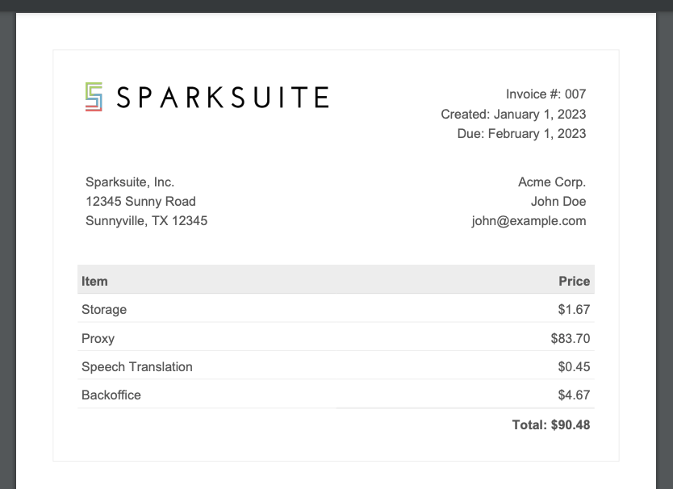

## Considerations

```bash
- Do we need to store all the logs for audit?
- Scale of the platform
- Granularity needed
- I would probably use a columnar database with compression
- This is obviously really basic, need more info about usage, etc
- Also in a real project with many services I will change BillingService.php by processing all files within a folder that shares the same namespace and implementation
- There is another way: Not logging every min but just the changes, but in the billing processing I prefer the simple way less prone to bugs and better auditable and the size of the records to keep a granularity of 1 min is viable and could be compress with a columnar database and archive all events if needed
```

## Setup

```bash
docker-compose up
docker-compose exec api composer install
```

## Run Migration

```bash
docker-compose exec api php artisan migrate
```

## Run Seeds

```bash
docker-compose exec api php artisan db:seed
```

## Endpoints

```bash
http://localhost/account/1/billing
http://localhost/account/2/billing
```


